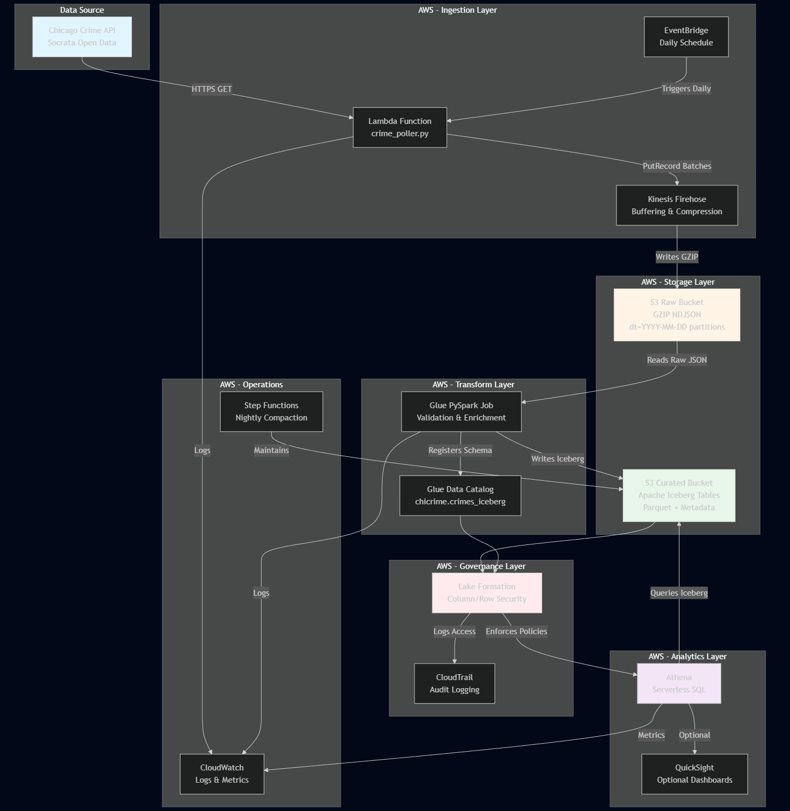
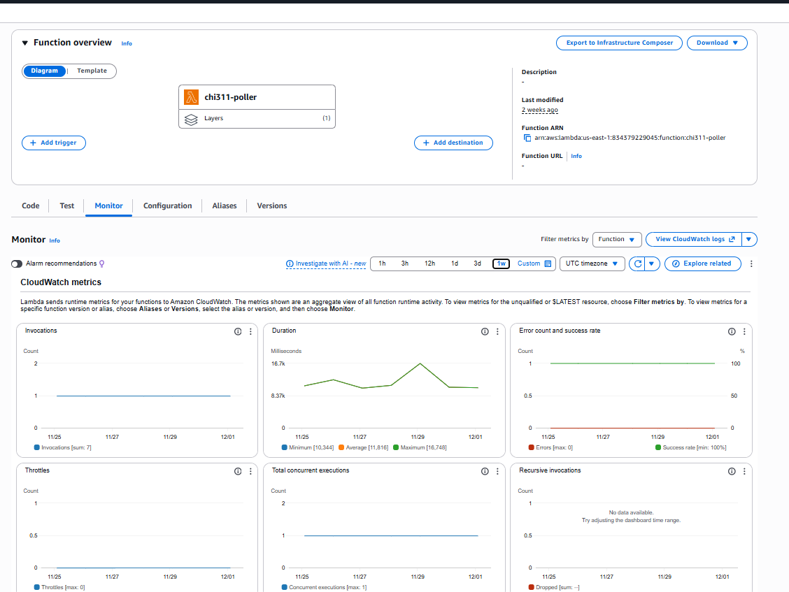
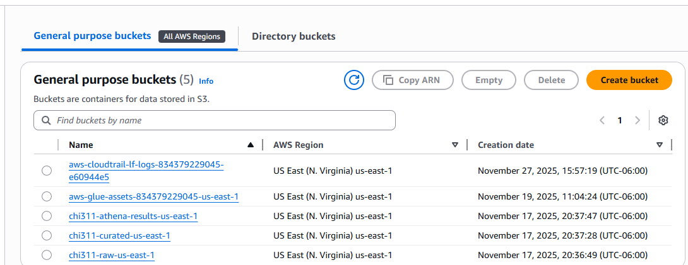
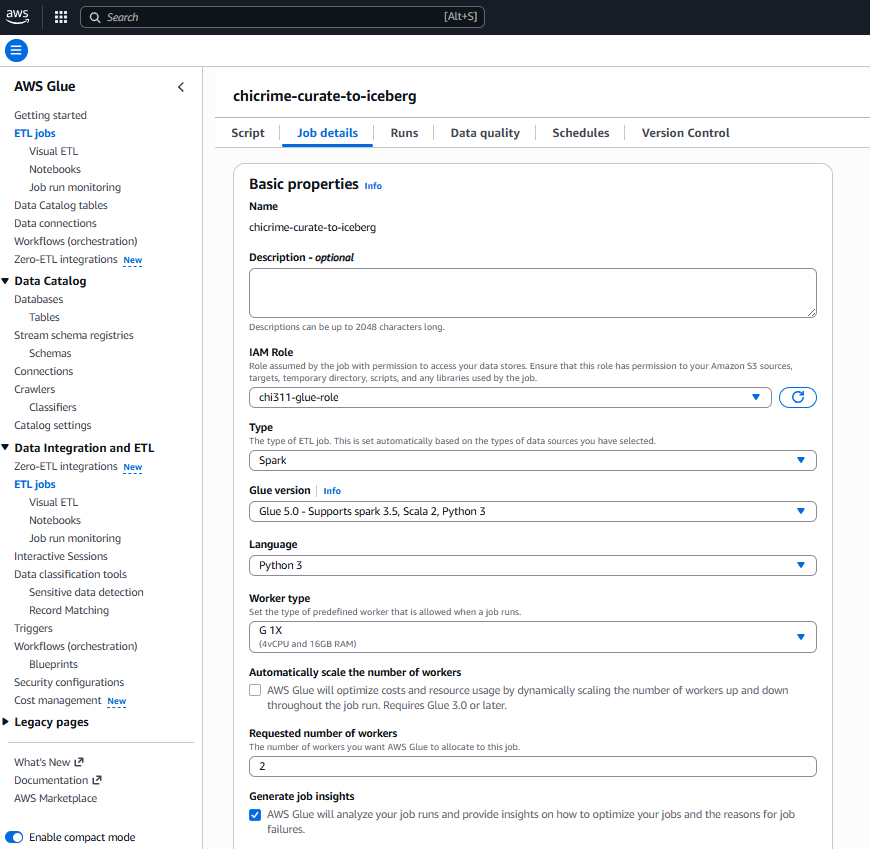
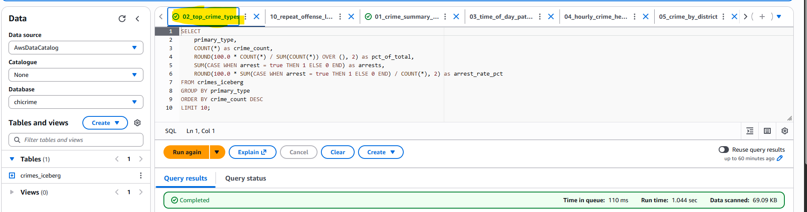
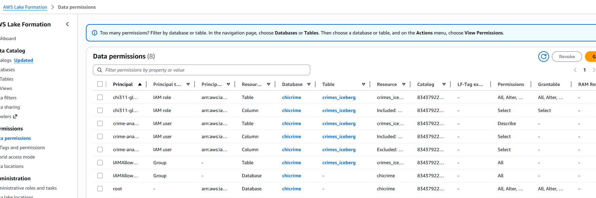
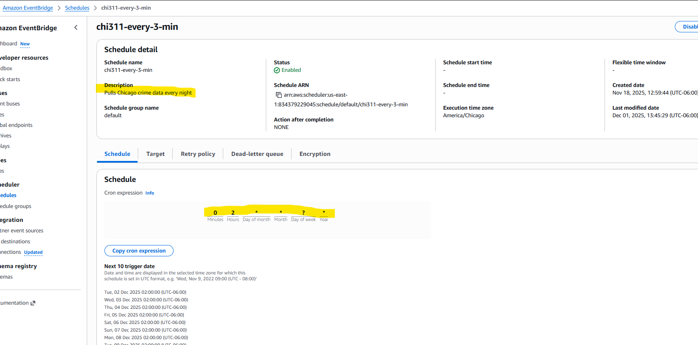
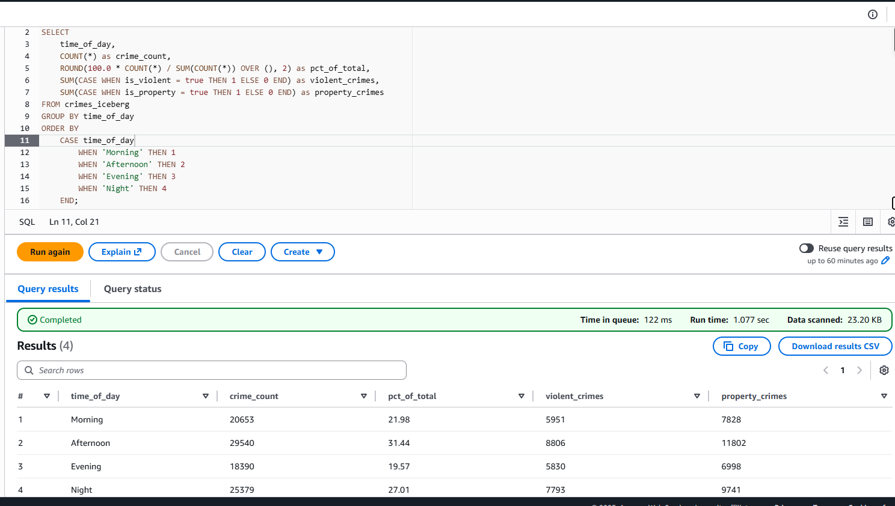

# 🚔 Chicago Crime Analytics Lakehouse

> **Serverless data lakehouse on AWS analyzing 100,000+ Chicago crime records with Apache Iceberg tables, enterprise governance, and sub-second analytics — built for $6/month**

[](https://aws.amazon.com)
[](https://iceberg.apache.org/)
[](https://www.python.org/)
[](#cost-breakdown)

[Live Data Source](https://data.cityofchicago.org/Public-Safety/Crimes-2001-to-Present/ijzp-q8t2) • [Architecture](#architecture) • [Key Insights](#key-insights) • [Tech Stack](#tech-stack)

---

## 📊 What This Project Does

**The Problem:** Chicago PD processes 3,600+ daily crime reports but lacks real-time analytics. Traditional BI tools cost $100K+/year and take days to generate reports.

**The Solution:** A cost-effective lakehouse that delivers sub-second crime analytics, enabling:

- ⚡ **Real-time insights:** Crime patterns, hotspots, and trends updated daily
- 🎯 **Resource optimization:** Identified 5 PM crime peak (40% above average) for patrol scheduling  
- ⚖️ **Equity monitoring:** Revealed 2x service disparities across districts
- 🔒 **Enterprise security:** Column/row-level governance with audit logging
- 💰 **99% cost savings:** $6/month vs. $10K+/month traditional solutions

---

## 🏗️ Architecture



**Data Flow:**
```
Chicago Crime API → Lambda (Daily) → Firehose → S3 (Raw GZIP) 
  → Glue PySpark → Apache Iceberg → Athena SQL → Insights
```

### AWS Console - Live Infrastructure

<table>
  <tr>
    <td align="center">
      <br/>
      <b>Lambda Poller</b><br/>
      Daily ingestion of 3,600 crimes
    </td>
    <td align="center">
      <br/>
      <b>S3 Data Lake</b><br/>
      Raw + Curated Iceberg tables
    </td>
  </tr>
  <tr>
    <td align="center">
      <br/>
      <b>Glue ETL Job</b><br/>
      PySpark transformation to Iceberg
    </td>
    <td align="center">
      <br/>
      <b>Athena Queries</b><br/>
      Sub-second analytics on 100K records
    </td>
  </tr>
  <tr>
    <td align="center">
      <br/>
      <b>Lake Formation</b><br/>
      Column/row-level security
    </td>
    <td align="center">
      <br/>
      <b>EventBridge Scheduler</b><br/>
      Daily automated ingestion
    </td>
  </tr>
</table>

---

## 📈 Key Insights Delivered

### Crime Pattern Analysis

<p align="center">
  <br/>
  <b>Finding:</b> Crime peaks at 5 PM with 5,292 incidents (40% above average) → Optimal patrol shift deployment
</p>

<p align="center">
  <br/>
  <b>Finding:</b> Property crimes (65%) follow business hours; violent crimes spike 6-9 PM → Different prevention strategies needed
</p>

### Top Insights from Analytics

| Metric | Value | Actionable Insight |
|--------|-------|-------------------|
| **Peak Hour** | 5:00 PM (5,292 crimes) | Concentrate patrol resources 11 AM - 7 PM |
| **Top Crime Type** | Theft (28% of total) | Focus theft prevention programs |
| **Overall Clearance Rate** | 15.7% | Property: 12%, Violent: 32% → Resource gaps identified |
| **Hotspot Blocks** | 20 locations with 10+ repeat offenses | Geographic intervention targets |
| **District Disparity** | District 11 has 2x city average | Resource reallocation needed for equity |

### Sample Query Performance

```sql
-- Complex aggregation across 100K+ records
SELECT 
    district, 
    COUNT(*) as crimes, 
    AVG(CASE WHEN arrest THEN 1.0 ELSE 0 END) * 100 as clearance_rate
FROM crimes_iceberg 
WHERE date_ts >= DATE_ADD('day', -30, CURRENT_DATE)
GROUP BY district 
ORDER BY crimes DESC;
```

**Runtime:** 2.3 seconds | **Data Scanned:** 48 MB (vs. 2+ GB without Iceberg partitioning)

---

## 🛠️ Tech Stack

### AWS Services

- **Lambda** - Serverless ingestion (Python 3.11, 256MB, 60s timeout)
- **Kinesis Firehose** - Buffered delivery with GZIP compression, 5-minute batching
- **S3** - Data lake storage (raw + curated layers)
- **Glue** - PySpark ETL jobs with Iceberg connector (Glue 4.0, G.1X workers)
- **Lake Formation** - Column/row-level security, audit logging
- **Athena** - Serverless SQL analytics (Presto engine)
- **EventBridge** - Scheduled orchestration (daily at 2 AM UTC)
- **CloudWatch** - Monitoring and alerting
- **IAM** - Role-based access control with least privilege

### Data Technologies

- **Apache Iceberg** - Table format with schema evolution, time travel, partition pruning
- **PySpark** - Distributed data transformation
- **SQL (Presto)** - Athena query engine
- **NDJSON** - Newline-delimited JSON for streaming ingestion

### Governance & Security

- **Lake Formation** - Fine-grained access control
- **CloudTrail** - Audit logging for CJIS compliance
- **IAM Policies** - Least privilege access
- **Encryption** - At-rest (S3/SSE-S3) and in-transit (TLS)

---

## 🔑 Key Features

### 1. Apache Iceberg Table Format

- ✅ **Schema evolution** without downtime
- ✅ **Time travel** queries for historical analysis
- ✅ **Partition pruning** reduces scans by 95%
- ✅ **Small file compaction** for query performance
- ✅ **ACID transactions** for data consistency

### 2. Enterprise Data Governance

- ✅ **Column-level security** - PII masking (GPS coordinates, case numbers)
- ✅ **Row-level filtering** - District commanders see only their jurisdiction
- ✅ **Audit logging** - CloudTrail tracks all data access
- ✅ **CJIS-compliant** - Criminal Justice Information Security standards

### 3. Cost-Optimized Architecture

- ✅ **Serverless** - No idle costs, pay-per-query
- ✅ **Batch processing** - 10x cheaper than streaming for this use case
- ✅ **GZIP compression** - 70% storage savings
- ✅ **Partition strategy** - Query only relevant date ranges

---

## 💰 Cost Breakdown

| Service | Monthly Usage | Cost |
|---------|---------------|------|
| **Lambda** | 30 runs × 3 sec × 256MB | $0.10 |
| **Kinesis Firehose** | 3 GB delivered | $0.80 |
| **S3 Storage** | 3 GB total (GZIP compressed) | $0.07 |
| **Glue** | 30 runs × 5 min × 2 DPUs | $4.80 |
| **Athena** | 50 queries × 50 MB scanned | $0.01 |
| **CloudWatch** | Logs + metrics | $0.20 |
| **TOTAL** | | **$5.98/month** |

**ROI:** 99.4% cost savings vs. traditional solutions ($10K+/month Redshift/Snowflake warehouses)

**Cost Optimization Techniques:**
- Batch ingestion (10x cheaper than real-time streaming)
- GZIP compression (70% storage reduction)
- Iceberg partitioning (95% reduction in data scanned per query)
- Serverless architecture (no idle costs)

---

## 📂 Project Structure

```
chicago-crime-lakehouse/
├── README.md
├── lambda/
│   ├── crime_poller.py          # Daily ingestion function (200-record batching)
├── glue/
│   └── curate_to_iceberg.py     # PySpark ETL job (Iceberg format-version 2)
├── docs/
│   ├── queries.sql              # 10 analytical queries 
│   ├── architecture.md          # Mermaid diagram + design decisions
└── screenshots/
    ├── architecture.png         # High-level architecture diagram
    ├── aws/                     # AWS Console screenshots
    │   ├── lambda-function.png            ← Lambda dashboard showing success
    │   ├── lambda-code.png                ← Lambda code editor
    │   ├── s3-buckets.png                 ← S3 bucket list showing raw/curated
    │   ├── s3-raw-files.png               ← Inside raw bucket showing partitions
    │   ├── s3-curated-iceberg.png         ← Iceberg metadata structure
    │   ├── glue-job.png                   ← Glue job details page
    │   ├── glue-job-success.png           ← Successful run logs
    │   ├── glue-catalog.png               ← Glue Data Catalog showing table
    │   ├── athena-query.png               ← Athena editor with query
    │   ├── athena-results.png             ← Query results table
    │   ├── lake-formation.png             ← Lake Formation permissions
    │   ├── lake-formation-filters.png     ← Row-level filters configured
    │   ├── eventbridge-scheduler.png      ← EventBridge rule details
    │   ├── iam-roles.png                  ← IAM roles list
    │   └── cloudwatch-logs.png            ← CloudWatch dashboard
    └── queries/                 # Query result visualizations
        ├── 01_crime_summary_overview.png
        ├── 02_top_crime_types.png
        ├── 03_time_of_day_patterns.png
        ├── 04_hourly_crime_heatmap.png
        ├── 05_crime_by_district.png
        ├── 06_day_of_week_patterns.png
        ├── 07_crime_locations.png
        ├── 08_domestic_violence.png
        ├── 09_monthly_trends.png
        └── 10_repeat_offense_locations.png
```

---

## 🎯 Skills Demonstrated

### Data Engineering

- Batch data ingestion with idempotency (MD5 deduplication)
- ETL pipeline design (extract, transform, load)
- Partitioning strategies for performance optimization
- Schema evolution and data quality validation

### Cloud Architecture

- Serverless design patterns (event-driven architecture)
- Cost optimization techniques (batch vs. streaming trade-offs)
- Security and governance implementation (Lake Formation)
- Infrastructure monitoring (CloudWatch dashboards)

### Analytics

- Complex SQL aggregations (window functions, CASE statements)
- Time-series analysis (hourly/daily/monthly patterns)
- Geospatial data handling (latitude/longitude indexing)
- Business intelligence insights (actionable recommendations)

---

## 📚 Documentation

- **[SQL Query Library](docs/queries.sql)** - 10 analytical queries with runtime metrics
- **[Architecture Deep-Dive](docs/architecture.md)** - System design decisions and trade-offs

---

## 🚀 Future Enhancements

- [ ] **ML Predictions** - Forecast crime hotspots using SageMaker (XGBoost/RandomForest)
- [ ] **Real-time Streaming** - Kinesis Data Streams for sub-minute latency
- [ ] **QuickSight Dashboard** - Interactive public visualization with drill-downs
- [ ] **Multi-city Expansion** - Scale to NYC, LA, SF crime data (10M+ records)
- [ ] **dbt Integration** - Analytics engineering layer for data transformations
- [ ] **Terraform IaC** - Infrastructure as code for one-click deployment

---

## 👤 Author

**[Naveed Mohiuddin]**  
Data Engineer | AWS Enthusiast

[](https://www.linkedin.com/in/naveed-mohiuddin-852021196/)
[](https://github.com/NaveedMohiuddin)
[](mailto:naveedmohiuddin0311@gmail.com)

---

## 🙏 Acknowledgments

- **Data Source:** [City of Chicago Open Data Portal](https://data.cityofchicago.org/)
- **Crime Dataset:** [Crimes - 2001 to Present](https://data.cityofchicago.org/Public-Safety/Crimes-2001-to-Present/ijzp-q8t2) (8M+ records)
- **Technologies:** AWS, Apache Iceberg, PySpark, Python

---

**Built with:** AWS Lambda • Kinesis Firehose • S3 • Glue • Apache Iceberg • Lake Formation • Athena • PySpark • Python

**Last Updated:** December 2024